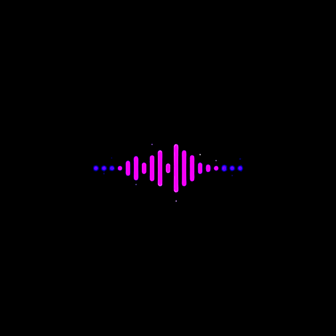
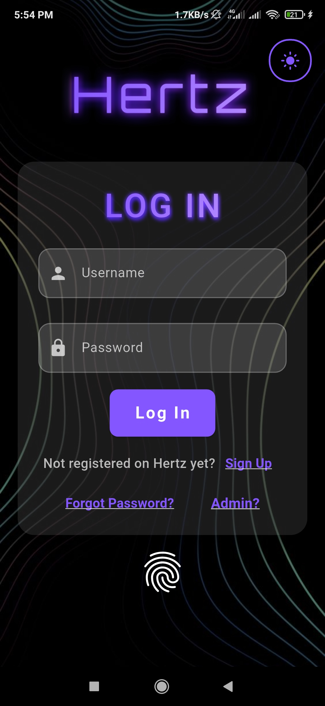
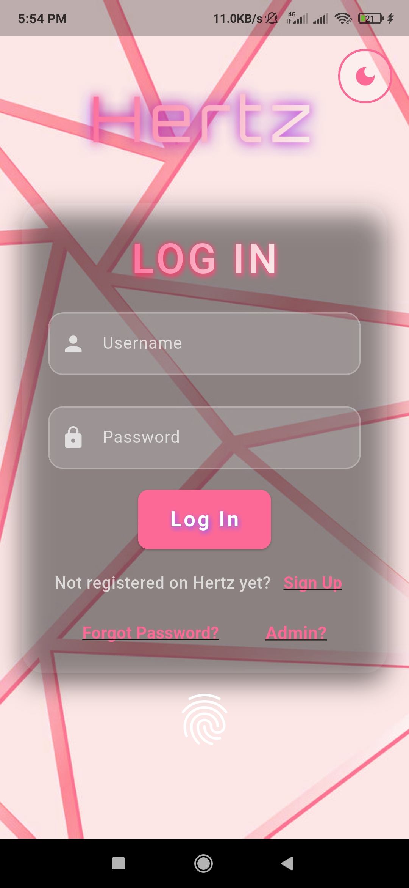
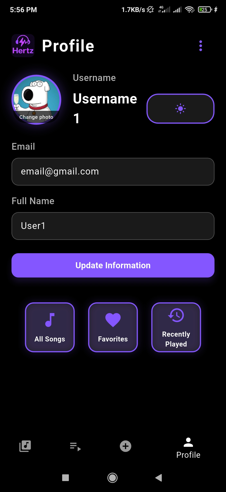

# 🎵 Hertz - Music Streaming App

<div align="center">



**A modern, feature-rich music streaming application built with Flutter**

[](https://flutter.dev/)
[](https://dart.dev/)
[](LICENSE)

</div>

---

## 🔗 Repositories

- **Frontend (this repo)**: [github.com/ArshaFrn/MusicPlayer](https://github.com/ArshaFrn/MusicPlayer)
- **Backend (server repo)**: [github.com/ShayanDZ/MusicPlayerServer](https://github.com/ShayanDZ/MusicPlayerServer)

---

## ✨ Features

### 🎧 Music Streaming
- **High-quality audio playback** with just_audio
- **Seamless music streaming** from your personal library
- **Background audio playback** support
- **Audio metadata extraction** and display
- **Crossfade and audio effects**

### 🎨 Beautiful UI/UX
- **Dual Theme Support**: 
  - 🌙 **Dark Theme**: Neon purple (#8456FF) with sleek black backgrounds
  - ☀️ **Light Theme**: Elegant pink (#fc6997) with clean white surfaces
- **Smooth animations** and transitions
- **Responsive design** for all screen sizes
- **Custom Orbitron font** for futuristic aesthetics
- **Glassmorphism effects** and modern UI elements

### 🔐 Authentication & Security
- **Secure user authentication** with password validation
- **Fingerprint/ biometric login** support
- **Password reset** via email verification
- **Session management** with SharedPreferences
- **Input validation** and error handling

### 📚 Music Management
- **Personal music library** with upload support
- **Playlist creation** and management
- **Favorites system** with like/dislike functionality
- **Recently played** tracking
- **Public music sharing** capabilities
- **Music metadata** editing and management

### 👤 User Experience
- **Profile management** with avatar upload
- **User preferences** and settings
- **Search functionality** across your library
- **Mini player** for continuous playback
- **Offline caching** for downloaded tracks

### 🔧 Advanced Features
- **Admin dashboard** for system management
- **Developer mode** for testing
- **Real-time TCP communication** with server
- **File picker** for music uploads
- **Share functionality** for tracks and playlists

---

## 📸 Screenshots

<div align="center">





</div>

---

## 🚀 Getting Started

### Prerequisites

- **Flutter SDK** (3.7.2 or higher)
- **Dart SDK** (3.0 or higher)
- **Android Studio** / **VS Code**
- **Android SDK** (for Android development)
- **Xcode** (for iOS development, macOS only)

### Installation

1. **Clone the repository**
   ```bash
   git clone https://github.com/ArshaFrn/MusicPlayer.git
   cd MusicPlayer
   ```

2. **Install dependencies**
   ```bash
   flutter pub get
   ```

3. **Configure the server connection**
   - Update the server address in `lib/TcpClient.dart`
   - Default: `10.0.2.2:12345` (for Android emulator)

4. **Run the application**
   ```bash
   flutter run
   ```

### Building for Production

**Android APK:**
```bash
flutter build apk --release
```

**iOS App Bundle:**
```bash
flutter build ios --release
```

**Web Build:**
```bash
flutter build web --release
```

---

## 📱 App Structure

```
lib/
├── main.dart                 # App entry point
├── Application.dart          # App configuration
├── TcpClient.dart           # Server communication
├── Response.dart            # Response models
├── Developer.dart           # Developer utilities
│
├── Model/                   # Data models
│   ├── User.dart
│   ├── Music.dart
│   ├── Artist.dart
│   ├── Album.dart
│   ├── Playlist.dart
│   └── Admin.dart
│
├── utils/                   # Utility classes
│   ├── AudioController.dart # Audio playback management
│   ├── CacheManager.dart    # File caching system
│   ├── ThemeProvider.dart   # Theme management
│   └── SnackBarUtils.dart   # UI notifications
│
├── controllers/             # Page controllers
│   ├── LibraryPageController.dart
│   ├── PlayPageController.dart
│   └── ProfilePageController.dart
│
├── widgets/                 # Reusable widgets
│   ├── MiniPlayer.dart      # Mini audio player
│   └── FingerprintLoginButton.dart
│
└── [Page Files]            # Main app pages
    ├── HomePage.dart
    ├── LibraryPage.dart
    ├── PlayPage.dart
    ├── ProfilePage.dart
    ├── SearchPage.dart
    ├── PlaylistsPage.dart
    ├── FavouritesPage.dart
    ├── RecentlyPlayedPage.dart
    ├── AddPage.dart
    ├── SignUpPage.dart
    ├── ForgotPasswordPage.dart
    ├── ChangePasswordPage.dart
    ├── AdminLoginPage.dart
    └── AdminDashboardPage.dart
```

---

## 🎨 Theme System

### Dark Theme (Neon Purple)
- **Primary**: `#8456FF` (Neon Purple)
- **Secondary**: `#671BAF` (Deep Purple)
- **Background**: `#000000` (Pure Black)
- **Surface**: `#1A1A1A` (Dark Gray)
- **Text**: `#FFFFFF` (White)

### Light Theme (Pink-White)
- **Primary**: `#fc6997` (Pink)
- **Secondary**: `#f8f5f0` (Off-White)
- **Background**: `#f8f5f0` (Light Cream)
- **Surface**: `#FFFFFF` (Pure White)
- **Text**: `#000000` (Black)

---

## 📦 Dependencies

### Core Dependencies
```yaml
flutter:
  sdk: flutter

# Audio & Media
just_audio: ^0.10.4
audio_metadata_reader: ^1.4.1
file_picker: ^10.2.0
image_picker: ^1.0.7

# State Management
provider: ^6.1.2

# Storage & Preferences
shared_preferences: ^2.5.3
path_provider: ^2.1.5
path: ^1.9.0

# Authentication
local_auth: ^2.3.0

# Utilities
share_plus: ^11.0.0
```

---

## 🔧 Configuration

### Server Connection
Update the server configuration in `lib/TcpClient.dart`:

```dart
final tcpClient = TcpClient(
  serverAddress: '10.0.2.2',  // Change for your server
  serverPort: 12345
);
```

### Theme Configuration
Modify theme settings in `lib/utils/ThemeProvider.dart`:

```dart
// Customize theme colors
static const Color darkPrimaryColor = Color(0xFF8456FF);
static const Color lightPrimaryColor = Color(0xFFfc6997);
```

---

## 🎯 Key Features Explained

### Audio Controller
The `AudioController` manages all audio playback functionality:
- **Singleton pattern** for global audio state
- **Playlist management** with shuffle and repeat
- **Background playback** support
- **Audio caching** for offline listening

### TCP Client
Handles all server communication:
- **Real-time connection** to Java server
- **JSON-based protocol** for data exchange
- **Error handling** and retry mechanisms
- **File upload/download** capabilities

### Theme Provider
Manages app theming:
- **Dynamic theme switching**
- **Persistent theme storage**
- **Custom color schemes**
- **Responsive UI adaptation**

---

## 🐛 Troubleshooting

### Common Issues

**1. Server Connection Failed**
- Verify server is running on correct port
- Check network connectivity
- Ensure correct server address in TcpClient

**2. Audio Playback Issues**
- Check file permissions
- Verify audio file format support
- Ensure proper audio session configuration

**3. Theme Not Persisting**
- Check SharedPreferences implementation
- Verify ThemeProvider initialization
- Ensure proper state management

### Debug Mode
Enable developer mode by using the developer credentials in the login screen.

---

## 📄 License

This project is licensed under the MIT License - see the [LICENSE](LICENSE) file for details.

---

## 🙏 Acknowledgments

- **Flutter Team** for the amazing framework
- **just_audio** package for audio functionality
- **Orbitron Font** creators for the beautiful typography
- **Material Design** for UI inspiration

---

<div align="center">

**Made with ❤️ and Flutter**

[](https://flutter.dev/)
[](https://dart.dev/)

</div>
